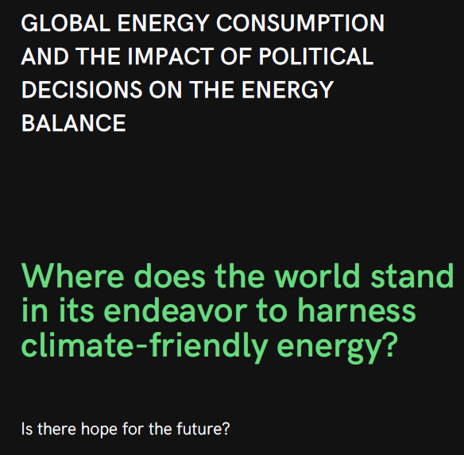

<!-- TABLE OF CONTENTS -->

### Table of Contents

* [About the Project](#about-the-project)

* [Slide deck details](#slide-deck-details)

* [Sources](#sources)

* [KPI Description and Abbreviations](#KPI -Description-and-Abbreviations)

* [Built With](#built-with)

  

### About the project

The analysis delves into the worldwide energy consumption trends and the consequences of political choices on energy equilibrium. It provides an overview about energy consumption in total, shows the status of green energy, and analyze risks of political decisions. 

### Slide deck details

### 

This repo is includes all raw and final files of my graduation project "Global energy consumption and the impact of political decisions on the energy balance".

##### 1

*Before we dive into this energetic journey, I have a fun little challenge for you. Please scan the QR code and participate in our sli.do guessing challenge.*

##### 2

*A leap back to 1962.*

*Imagine read the Life magzines and seeing this advertisement: "Each day ESSO supplies enough energy to melt 7 million tons of a glacier."*

*Feels like stepping into a time machine, doesn't it? But two things are glaringly obvious:*

- Oil companies had inklings of the impacts of their energy sources over 60 years ago.
- The consumption of fossil energy has skyrocketed by a staggering 430% since then.

*Think about it, in just one lifetime!*

##### 3

*"Numbers don't lie!"*

Here you see the total energy consumption worldwide in terawatt-hours and the face-off between fossil fuels and green energy.

"For those who took part in the sli.do game, let's see how close or off the mark you were!"

##### 4

Having gained a general insight into global energy consumption, let's zoom in a little closer.

##### 5

We've seen where we stand. How has green energy evolved over time?

- Within one dekade + 11percent points -> promising

##### 6

Highlighting some flagship countries in green development and a special focus on Germany. Seems like there's a "watery" issue here, doesn't it? So a huge chance for developing in this field

##### 7

With the next two slides, I want to point out the risks that can arise from wrong political decisions. I want to show this with 2 examples.

##### 8

 A look at Germany shows how evolving for solar energy has shiftet since the cut financial support for photovoltaic.

##### 9

The USA, a land of endless possibilities? 

USA rise from the biggest importeur of those energy sources to the biggest exporteur.

##### 10

 "As we near the end of our journey, I hope this presentation has shed some light on where we stand, and perhaps where we might be headed. 

The balance of energy is crucial for our future, and it's up to us to tip the scales in the right direction."

### KPI Description and Abbreviations

| column                                  | description                                                  |
| --------------------------------------- | ------------------------------------------------------------ |
| iso_code                                | ISO 3166-1 alpha-3 three-letter country codes                |
| country                                 | Geographic location                                          |
| year                                    | Year of observation                                          |
| coal_prod_change_pct                    | Annual percentage change in coal production                  |
| coal_prod_change_twh                    | Annual change in coal production, measured in terawatt-hours |
| gas_prod_change_pct                     | Annual percentage change in gas production                   |
| gas_prod_change_twh                     | Annual change in gas production, measured in terawatt-hours  |
| oil_prod_change_pct                     | Annual percentage change in oil production                   |
| oil_prod_change_twh                     | Annual change in oil production, measured in terawatt-hours  |
| energy_cons_change_pct                  | Annual percentage change in primary energy consumption       |
| energy_cons_change_twh                  | Annual change in primary energy consumption, measured in terawatt-hours |
| biofuel_share_elec                      | Share of electricity consumption that comes from biofuels    |
| biofuel_cons_change_pct                 | Annual percentage change in biofuel consumption              |
| biofuel_share_energy                    | Share of primary energy consumption that comes from biofuels |
| biofuel_cons_change_twh                 | Annual change in biofuel consumption, measured in terawatt-hours |
| biofuel_consumption                     | Primary energy consumption from biofuels, measured in terawatt-hours |
| biofuel_elec_per_capita                 | Per capita electricity consumption from biofuels, measured in kilowatt-hours |
| biofuel_cons_per_capita                 | Per capita primary energy consumption from biofuels, measured in kilowatt-hours |
| carbon_intensity_elec                   | Carbon intensity of electricity production, measured in grams of carbon dioxide emitted per kilowatt-hour |
| coal_share_elec                         | Share of electricity consumption that comes from coal        |
| coal_cons_change_pct                    | Annual percentage change in coal consumption                 |
| coal_share_energy                       | Share of primary energy consumption that comes from coal     |
| coal_cons_change_twh                    | Annual change in coal consumption, measured in terawatt-hours |
| coal_consumption                        | Primary energy consumption from coal, measured in terawatt-hours |
| coal_elec_per_capita                    | Per capita electricity consumption from coal, measured in kilowatt-hours |
| coal_cons_per_capita                    | Per capita primary energy consumption from coal, measured in kilowatt-hours |
| coal_production                         | Coal production, measured in terawatt-hours                  |
| coal_prod_per_capita                    | Per capita coal production, measured in kilowatt-hours       |
| electricity_generation                  | Electricity generation, measured in terawatt-hours           |
| biofuel_electricity                     | Electricity generation from biofuels, measured in terawatt-hours |
| coal_electricity                        | Electricity generation from coal, measured in terawatt-hours |
| fossil_electricity                      | Electricity generation from fossil fuels, measured in terawatt-hours. This is the sum of electricity generation from coal, oil and gas. |
| gas_electricity                         | Electricity generation from gas, measured in terawatt-hours  |
| hydro_electricity                       | Electricity generation from hydropower, measured in terawatt-hours |
| nuclear_electricity                     | Electricity generation from nuclear power, measured in terawatt-hours |
| oil_electricity                         | Electricity generation from oil, measured in terawatt-hours  |
| other_renewable_electricity             | Electricity generation from other renewable sources, measured in terawatt-hours |
| other_renewable_exc_biofuel_electricity | Electricity generation from other renewable sources excluding biofuels, measured in terawatt-hours |
| renewables_electricity                  | Electricity generation from renewables, measured in terawatt-hours |
| solar_electricity                       | Electricity generation from solar, measured in terawatt-hours |
| wind_electricity                        | Electricity generation from wind, measured in terawatt-hours |
| energy_per_gdp                          | Energy consumption per unit of GDP. This is measured in kilowatt-hours per 2011 international-$. |
| energy_per_capita                       | Primary energy consumption per capita, measured in kilowatt-hours per year |
| fossil_cons_change_pct                  | Annual percentage change in fossil fuel consumption          |
| fossil_share_energy                     | Share of primary energy consumption that comes from fossil fuels |
| fossil_cons_change_twh                  | Annual change in fossil fuel consumption, measured in terawatt-hours |
| fossil_fuel_consumption                 | Fossil fuel consumption, measured in terawatt-hours. This is the sum of primary energy from coal, oil and gas. |
| fossil_energy_per_capita                | Per capita fossil fuel consumption, measured in kilowatt-hours. This is the sum of primary energy from coal, oil and gas. |
| fossil_cons_per_capita                  | Per capita fossil fuel consumption, measured in kilowatt-hours. This is the sum of primary energy from coal, oil and gas. |
| fossil_share_elec                       | Share of electricity consumption that comes from fossil fuels (coal, oil and gas combined) |
| gas_share_elec                          | Share of electricity consumption that comes from gas         |
| gas_cons_change_pct                     | Annual percentage change in gas consumption                  |
| gas_share_energy                        | Share of primary energy consumption that comes from gas      |
| gas_cons_change_twh                     | Annual change in gas consumption, measured in terawatt-hours |
| gas_consumption                         | Primary energy consumption from gas, measured in terawatt-hours |
| gas_elec_per_capita                     | Per capita electricity consumption from gas, measured in kilowatt-hours |
| gas_energy_per_capita                   | Per capita primary energy consumption from gas, measured in kilowatt-hours |
| gas_production                          | Gas production, measured in terawatt-hours                   |
| gas_prod_per_capita                     | Per capita gas production, measured in kilowatt-hours        |
| hydro_share_elec                        | Share of electricity consumption that comes from hydropower  |
| hydro_cons_change_pct                   | Annual percentage change in hydropower consumption           |
| hydro_share_energy                      | Share of primary energy consumption that comes from hydropower |
| hydro_cons_change_twh                   | Annual change in hydropower consumption, measured in terawatt-hours |
| hydro_consumption                       | Primary energy consumption from hydropower, measured in terawatt-hours |
| hydro_elec_per_capita                   | Per capita electricity consumption from hydropower, measured in kilowatt-hours |
| hydro_energy_per_capita                 | Per capita primary energy consumption from hydropower, measured in kilowatt-hours |
| low_carbon_share_elec                   | Share of electricity consumption that comes from low-carbon sources. This is the sum of electricity from renewables and nuclear |
| low_carbon_electricity                  | Electricity generation from low-carbon sources, measured in terawatt-hours. This is the sum of electricity generation from renewables and nuclear power |
| low_carbon_elec_per_capita              | Per capita electricity consumption from low-carbon sources, measured in kilowatt-hours |
| low_carbon_cons_change_pct              | Annual percentage change in low-carbon energy consumption    |
| low_carbon_share_energy                 | Share of primary energy consumption that comes from low-carbon sources. This is the sum of primary energy from renewables and nuclear |
| low_carbon_cons_change_twh              | Annual change in low-carbon energy consumption, measured in terawatt-hours |
| low_carbon_consumption                  | Primary energy consumption from low-carbon sources, measured in terawatt-hours |
| low_carbon_energy_per_capita            | Per capita primary energy consumption from low-carbon sources, measured in kilowatt-hours |
| nuclear_share_elec                      | Share of electricity consumption that comes from nuclear power |
| nuclear_cons_change_pct                 | Annual percentage change in nuclear consumption              |
| nuclear_share_energy                    | Share of primary energy consumption that comes from nuclear power |
| nuclear_cons_change_twh                 | Annual change in nuclear consumption, measured in terawatt-hours |
| nuclear_consumption                     | Primary energy consumption from nuclear power, measured in terawatt-hours |
| nuclear_elec_per_capita                 | Per capita electricity consumption from nuclear power, measured in kilowatt-hours |
| nuclear_energy_per_capita               | Per capita primary energy consumption from nuclear, measured in kilowatt-hours |
| oil_share_elec                          | Share of electricity consumption that comes from oil         |
| oil_cons_change_pct                     | Annual percentage change in oil consumption                  |
| oil_share_energy                        | Share of primary energy consumption that comes from oil      |
| oil_cons_change_twh                     | Annual change in oil consumption, measured in terawatt-hours |
| oil_consumption                         | Primary energy consumption from oil, measured in terawatt-hours |
| oil_elec_per_capita                     | Primary energy consumption from oil, measured in terawatt-hours |
| oil_energy_per_capita                   | Per capita primary energy consumption from oil, measured in kilowatt-hours |
| oil_production                          | Oil production, measured in terawatt-hours                   |
| oil_prod_per_capita                     | Per capita oil production, measured in kilowatt-hours        |
| other_renewables_elec_per_capita        | Per capita electricity consumption from other renewables, measured in kilowatt-hours |
| other_renewables_share_elec             | Share of electricity consumption that comes from other renewables |
| other_renewables_cons_change_pct        | Annual percentage change in energy consumption from other renewables |
| other_renewables_share_energy           | Share of primary energy consumption that comes from other renewables |
| other_renewables_cons_change_twh        | Annual change in other renewable consumption, measured in terawatt-hours |
| other_renewable_consumption             | Primary energy consumption from other renewables, measured in terawatt-hours |
| other_renewables_energy_per_capita      | Per capita primary energy consumption from other renewables, measured in kilowatt-hours |
| per_capita_electricity                  | Electricity consumption per capita, measured in kilowatt-hours |
| population                              | Total population                                             |
| primary_energy_consumption              | Primary energy consumption, measured in terawatt-hours       |
| renewables_elec_per_capita              | Per capita primary energy consumption from renewables, measured in kilowatt-hours |
| renewables_share_elec                   | Share of electricity consumption that comes from renewables  |
| renewables_cons_change_pct              | Annual percentage change in renewable energy consumption     |
| renewables_share_energy                 | Share of primary energy consumption that comes from renewables |
| renewables_cons_change_twh              | Annual change in renewable energy consumption, measured in terawatt-hours |
| renewables_consumption                  | Primary energy consumption from renewables, measured in terawatt-hours |
| renewables_energy_per_capita            | Per capita electricity consumption from renewables, measured in kilowatt-hours |
| solar_share_elec                        | Share of electricity consumption that comes from solar       |
| solar_cons_change_pct                   | Annual percentage change in solar consumption                |
| solar_share_energy                      | Share of primary energy consumption that comes from solar    |
| solar_cons_change_twh                   | Annual change in solar consumption, measured in terawatt-hours |
| solar_consumption                       | Primary energy consumption from solar, measured in terawatt-hours |
| solar_elec_per_capita                   | Per capita electricity consumption from solar, measured in kilowatt-hours |
| solar_energy_per_capita                 | Per capita primary energy consumption from solar, measured in kilowatt-hours |
| gdp                                     | Total real gross domestic product, inflation-adjusted        |
| wind_share_elec                         | Share of electricity consumption that comes from wind        |
| wind_cons_change_pct                    | Annual percentage change in wind consumption                 |
| wind_share_energy                       | Share of primary energy consumption that comes from wind     |
| wind_cons_change_twh                    | Annual change in wind consumption, measured in terawatt-hours |
| wind_consumption                        | Primary energy consumption from wind, measured in terawatt-hours |
| wind_elec_per_capita                    | Per capita electricity consumption from wind, measured in kilowatt-hours |
| wind_energy_per_capita                  | Per capita primary energy consumption from wind, measured in kilowatt-hours |

### Sources

- https://www.kaggle.com/datasets/belayethossainds/renewable-energy-world-wide-19652022
- https://ember-climate.org/countries-and-regions/

### Built With

This section should list any major frameworks that you built your project using. Leave any add-ons/plugins for the acknowledgements section. Here are a few examples.

* [Jupyter Notebook](https://jupyter.org)

* [Python](https://www.python.org)

* [Tableau](https://www.tableau.com/)

  * Find it on tableau public: [Global energy balance](https://public.tableau.com/app/profile/sven.deiwicks/viz/GlobalEnergyBalance/Story1)  

* [Canva](https://www.canva.com)

  

### License

Distributed under the MIT License. See `LICENSE` for more information.

### Contact

Your Name - [@linkedinr](https://www.linkedin.com/in/svendeiwicks) - sven.deiwicks@gmail.com

Project Link: [https://github.com/fuxxs81/Global-energy-balance](https://github.com/fuxxs81/Global-energy-balance)
